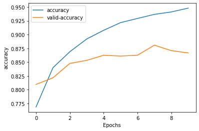

# Bio-sensor-human-action-recognition-with-CNN-RNN
This project provided a Deep CNN network to detect daily human activity from an integrated mobile accelerator sensor. In making this network, we made time series from sensor data and designed our network with CNN and GRU layers to detect 6 different activities. The classification and training process are available in the images below. 

